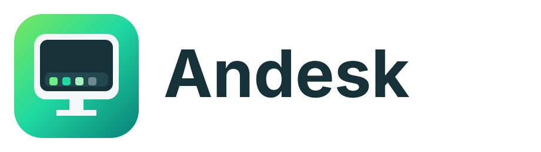

<p align="center"></p>

# Andesk

**An Android desktop launcher built for a real session-based desktop experience.**

Andesk turns the Taskbar project into a DeX-style desktop shell for Android without trying to behave like a permanently running overlay utility. Open Andesk to start a desktop session; close the desktop and its taskbar, widgets, menus and overlays shut down with it.

## What makes Andesk different

- **Desktop-owned lifecycle:** the taskbar and desktop services exist only while the Andesk desktop session is active.
- **Desktop launcher:** wallpaper, desktop icons, widgets, Start menu, recent apps and system tray in one session.
- **Safe exit behavior:** Back, Alt+F4, Exit Desktop, force-stop, and swiping the desktop from Recents shut the session down.
- **No resurrection:** reboot, package update, stale preferences or background service restarts do not silently bring the taskbar back.
- **Desktop appearance presets:** Classic/customizable, Windows 10-like and Windows 11-like layouts.
- **Resizable taskbar:** Compact, Standard and Large geometry presets.
- **Widgets:** add, move and resize Android widgets directly on the desktop.
- **Control center:** time/date, Wi-Fi, Bluetooth, volume, notifications, settings and Exit Desktop.
- **Keyboard friendly:** Windows/Meta opens Start; Alt+F4 exits the desktop session.
- **Freeform support:** retains compatible Taskbar freeform-window functionality where Android allows it.

## Session model

Opening another Android app does **not** end Andesk. The desktop remains alive underneath and is restored when you return. Closing the Andesk desktop itself is different: that ends the session and removes all Andesk overlays and services.

## Building

The GitHub Actions workflow uses JDK 21 and runs:

```text
./gradlew assembleFreeDebug
./gradlew spotlessCheck
./gradlew testFreeDebug
```

The debug APK is uploaded as a CI artifact after a successful build.

## Project origin

Andesk is a fork of [Taskbar](https://github.com/farmerbb/Taskbar) by Braden Farmer and retains substantial upstream code and history. The goal of this fork is specifically to evolve Taskbar into a session-based Android desktop launcher rather than a persistent standalone taskbar utility.

Andesk is not affiliated with or endorsed by Samsung, Google, or the Android project. "DeX" is referenced only descriptively when discussing the style of desktop experience that inspired this fork.

## License

This project continues under the upstream Apache License 2.0. See `LICENSE` for details.
